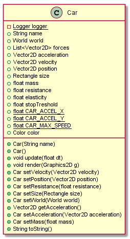
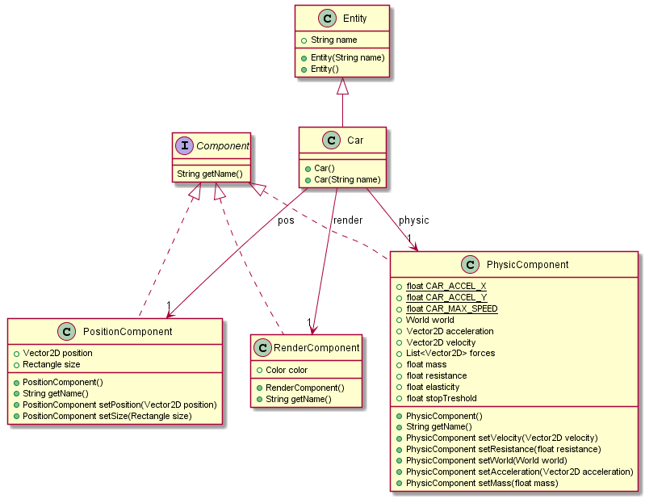

### The game object.

```Java
class Car {
    Vector2D position;
    Vector2D size;
    Vector2D velocity;
    Vector2D acceleration;

    float resistance;
    float elasticity;

    public void update(float dt) {
    }

    public void render(Graphics2D g) {
    }
}
```



### The Refactored Car entity/component oriented.

#### The car entity

This is the basic entity to be inherited by business entity.

```Java
class Entity {
    String name;

    public Entity(String name) {
    }

    public String getName() {
    }

}
```

The implemented Car entity

```Java
class Car extends Entity {
    PositionComponent pos;
    PhysicComponent physic;
    RenderComponent render;
}
```

#### The Components

Position component containing position and size information.

```Java
class PositionComponent implements Component {
    Vector2D position;
    Vector2D size;
    Vector2D velocity;
    Vector2D acceleration;

    float resistance;
    float elasticity;
}
```

The physic components containing all physic computation needed data.

```Java
class PositionComponent implements Component {
    Vector2D position;
    Vector2D size;
    Vector2D velocity;
    Vector2D acceleration;

    float resistance;
    float elasticity;
}
```



### The Systems

And the the needed Systems :

What is a System ?

```Java
interface System {
    void update(Application app, float dt);
}
```

And what are the implemented system.

```Java
class CarSystem implements System {
    public void update(Application app, float dt) {
        // see details in code :) ...
    }
}
```

The system to manage input:

```Java
class InputSystem implements System {
    public void update(Application app, float dt) {
        // see details in code :) ...
    }
}
```

The System to render things on screen:

```Java
class RenderSystem implements System {
    public void update(Application app, float dt) {
        // see details in code :) ...
    }
}
```

## Moving to a more framework oriented implementation

Replace components attribute's from `Car` by a `Component` map in the `Entity` class.

```java
class Car extends Entity {
    public Car(String name) {
        add(new PositionCompoent());
        add(new PhysicCompoent());
        add(new RenderCompoent());
    }
}
```

### Upgrading Entity

And now, the `Entity` is mosdified to propose a map of components, and the capability to add component to this one.

```java
class Entity<T> {
    public String name;
    private Map<String, Component> components;

    public Entity<T> add(Component c) {
    }
}
```

And the implemented `System` must be adapted to use `Entity` objects and no more `Car` class.

The `MoveSystem` is now managing a bunch of `Entity` and not only `Car`. It will parse the `Applicaiton#entities` map,
and detect the ones having the right `Components` to move the matching entities.


### One SystemManager to rules'em all

To get the full hand on the implemented System, and free all resources when stopping your application, the best way to
proceed is to implement a System manager. This class will be the indexer for all System your program will have to work
with.

This `SystemManager` will have to propose a clear API to add, get or remove some services.

```java
class SystemManager {
    private Map<String, System> systems;

    public System get(String name) {
    }

    public void remove(String name) {
    }

    public List<System> getAll() {
    }
}
```

And then you can implement the service you need by implementing the System interface.

```java
class MySuperSystem implements System {
    public void update(long dt) {
        // where all happened in my super service.
    }
}
```

### Using the SSM und System

And then add it to the SystemManager:

```java
import fr.mcgivrer.prototype.ecsfmk.systems.SystemManager;

class Game {
    SystemManager sm;

    //...
    public static void main(Strng[] argc) {
        Game g = new Game();
        g.run();
    }

    //..
    public void initialize() {
        // initialize the System Manager
        sm = SystemManager.get(this);
        // Add the needed System
        sm.add(new MySuperSystem(this));
    }

    //...

    public void udpate(long dt) {
        // here is where I need the System !
        MySuperSystem mss = sm.get("superSystem");
        ssm.update(dt);
    }

}
```